### Project Report: Online Train Ticket Booking System

#### Introduction

The Online Train Ticket Booking System is a web-based application designed to facilitate the booking of train tickets for passengers. The system aims to streamline the ticket booking process, making it more efficient and user-friendly for both passengers and administrators. This report provides an overview of the project's functionalities, technical details, implementation process, and future enhancements.

#### Objectives

- To provide a seamless online platform for booking train tickets.
- To ensure secure and efficient management of passenger and train information.
- To enable administrators to manage train schedules and monitor bookings.
- To enhance user experience through a responsive and intuitive interface.

#### Functionalities

**User Authentication:**
- Login and registration for users.
- Role-based access control (admin and passenger).

**Booking Process:**
- Selection of train and date.
- Input of passenger details.
- Validation and availability check for train seats.
- Confirmation of booking with the generation of a PNR number.

**Admin Panel:**
- Management of train schedules.
- Monitoring and management of bookings.
- View and update train availability.

#### Technical Details

**Technologies Used:**
- **Frontend:** HTML, CSS, JavaScript
- **Backend:** PHP
- **Database:** MySQL (using PDO for secure database interactions)
- **Session Management:** PHP Sessions

**Security Measures:**
- Input sanitization and validation to prevent SQL injection and XSS attacks.
- Role-based access control to restrict unauthorized access.
- Secure session management to maintain user states.

**Database Schema:**
- **Users Table:** Stores user credentials and roles.
- **Train Table:** Contains train schedules and availability.
- **Bookings Table:** Records booking information including PNR numbers and passenger details.

#### Implementation

**User Authentication:**
- Implemented using PHP sessions to maintain login states.
- Admin users are redirected to the admin panel upon successful login.

**Booking Process:**
- Users select a train and date from a dynamically populated list.
- Passenger details are entered and validated before proceeding.
- Seat availability is checked through stored procedures in MySQL.
- If seats are available, a PNR number is generated and stored.

**Admin Panel:**
- Admin users can add, update, or delete train schedules.
- Real-time monitoring of bookings and seat availability.

#### Code Snippet

**Sanitization of Inputs:**
```php
$name = $_POST['name'];
foreach ($name as $key => $value) {
    $name[$key] = htmlspecialchars(trim(stripslashes($value)), ENT_QUOTES, 'UTF-8');
}

// Similar sanitization for $age and $gender
```

**Error Handling with Try-Catch:**
```php
try {
    $query = "CALL check_seats_availabilty(:train_number, :date, :coach, :num_passengers)";
    $stmt = $conn->prepare($query);
    $stmt->bindParam(':train_number', $train_number);
    $stmt->bindParam(':date', $date);
    $stmt->bindParam(':coach', $coach);
    $stmt->bindParam(':num_passengers', $num_passengers);

    if ($stmt->execute() === FALSE) {
        $_SESSION['seats_error'] = $stmt->errorInfo();
        header('Location: not-available.php');
        exit();
    }
    // Further processing...
} catch (Exception $e) {
    echo "Error: " . $e->getMessage();
}
```

#### Challenges and Solutions

1. **SQL Injection and XSS Prevention:**
   - Implemented thorough input sanitization and validation.
   - Used prepared statements with PDO to interact with the database securely.

2. **Session Management:**
   - Ensured secure session handling to prevent session hijacking.
   - Used role-based access control to differentiate between admin and regular users.

3. **Real-Time Seat Availability:**
   - Utilized stored procedures to handle complex queries for seat availability efficiently.
   - Managed race conditions by locking tables during seat assignment.

#### Future Enhancements

- **Payment Gateway Integration:** To enable online payment for bookings.
- **Notification System:** Email or SMS notifications for booking confirmations and updates.
- **Mobile App:** Development of a mobile application for easier access.
- **Advanced Reporting:** Detailed reports for admins on booking trends and train utilization.

#### Conclusion

The Online Train Ticket Booking System is a comprehensive solution for managing train ticket bookings and schedules. By leveraging modern web technologies and ensuring robust security measures, the system provides a reliable platform for both passengers and administrators. Future enhancements will further improve the functionality and user experience, making it a more versatile and user-friendly application.


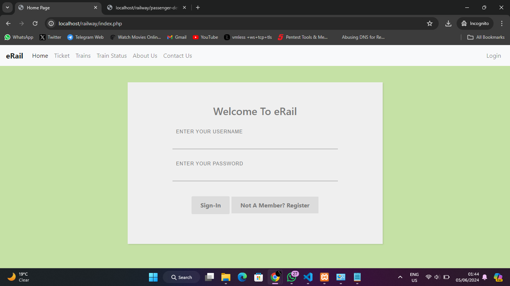

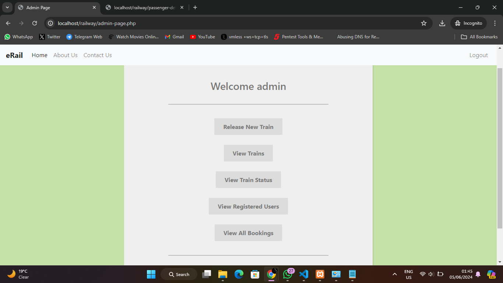

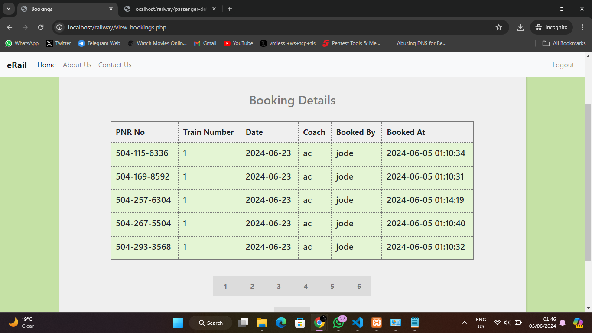

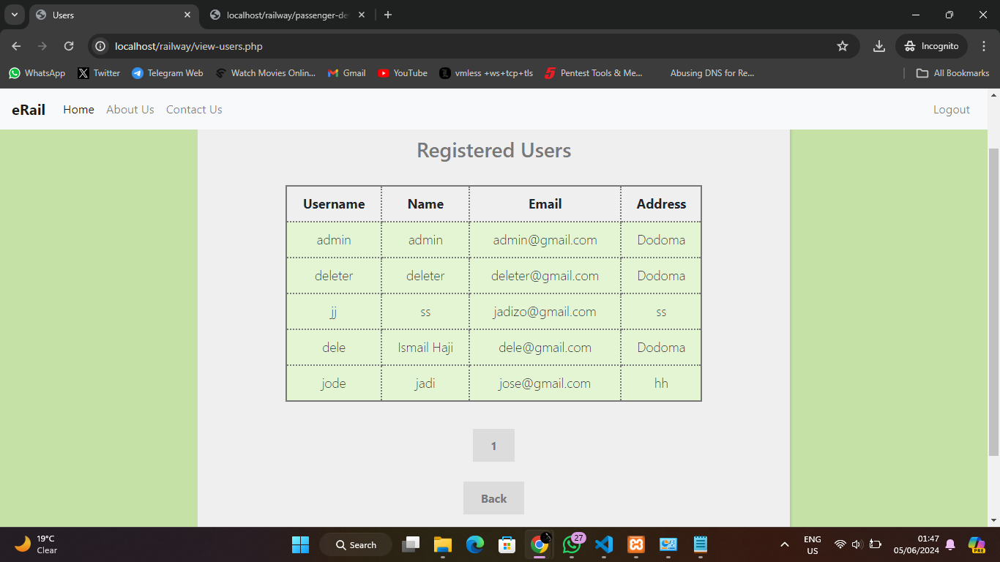

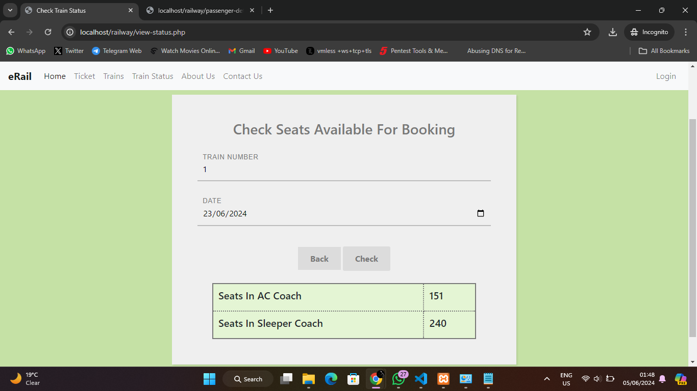

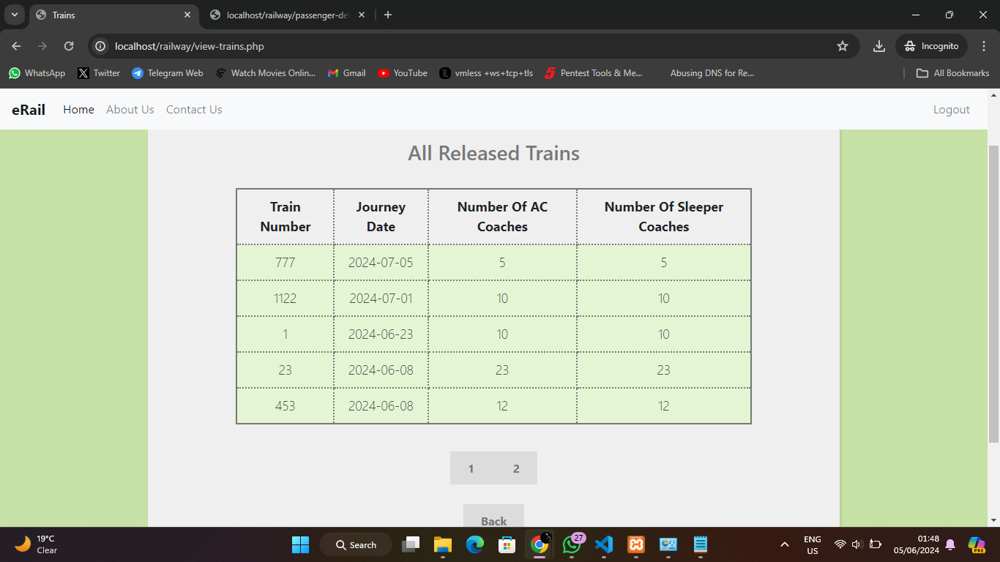

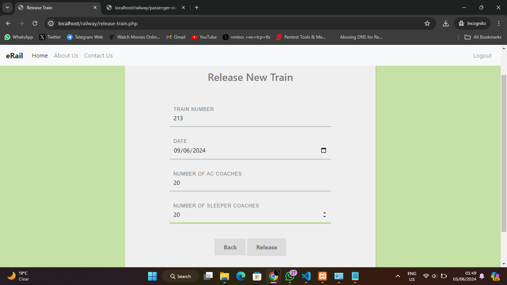

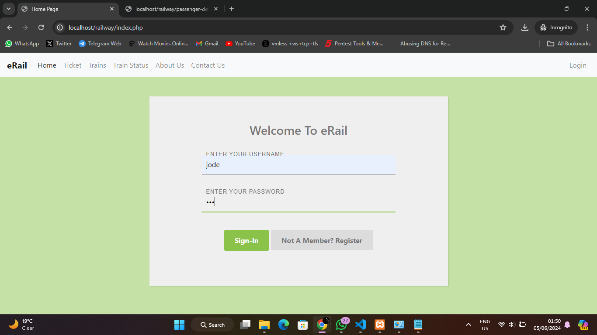

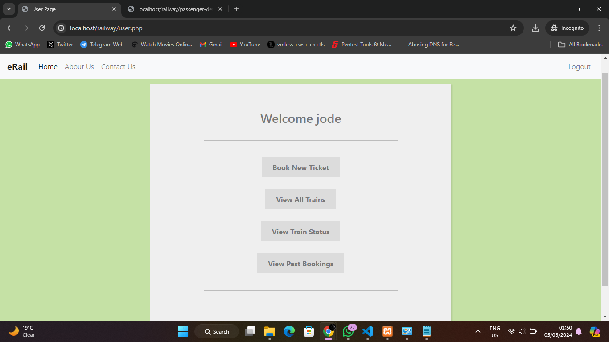

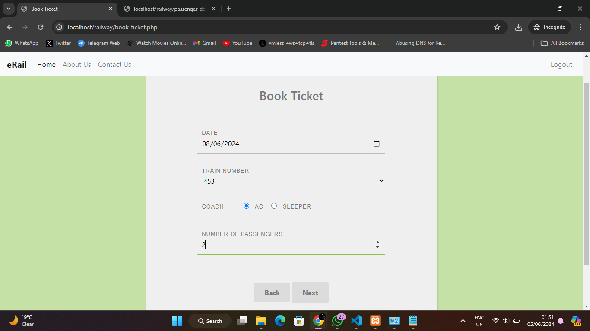

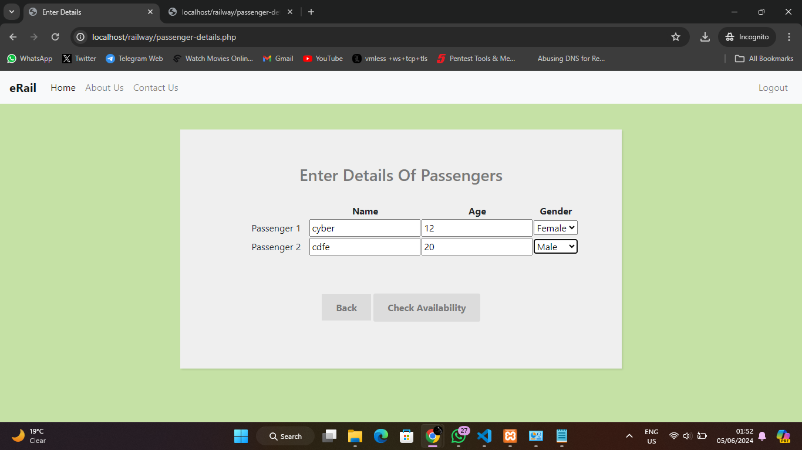

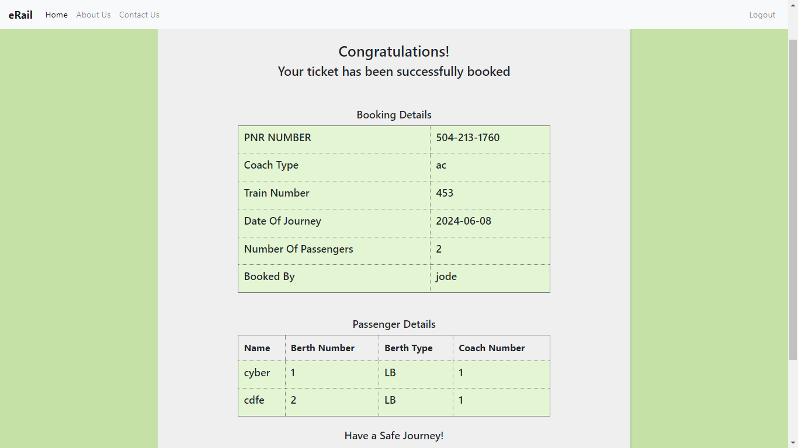

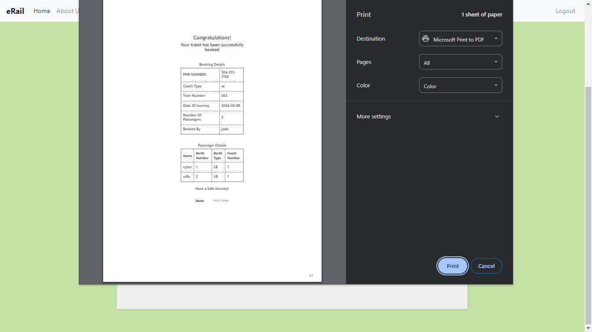


